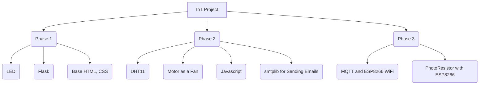

# IoT Project

## Table of Contents
1. [Phases](#phases)
2. [Tools used](#tools)
3. [Database Overview](#iothome-database)
4. [users Table](#users-table)
   - [Columns](#columns)
   - [Sample Data](#sample-data)
5. [Authors](#authors)

## Phases

## Tools
To work on this project, ensure you have the following set up:

- **Python**: Version 3.x installed for running Flask.
- **Flask**: Installed via `pip install flask`.
- **SQLite**: For local database storage.
- - **DHT11**: A sensor used to measure temperature and humidity.
- **Arduino IDE**: For programming Arduino microcontrollers and ESP8266.
- **ESP8266 WiFi Library**: To connect the ESP8266 modules to WiFi and send data such as Light Intensity Threshold to Raspberry Pi.
- **Raspberry Pi**: As the server environment.

## IoTHome Database
The SQLite database contains the following key table:

### users Table
The "users" table stores user-specific data for setting environmental thresholds in a smart home environment.

#### Columns
- **UserID** (Primary Key, Integer): A unique identifier for each user in the system.
- **Name** (String): The name of the user.
- **Temp. Threshold** (Decimal): The temperature threshold set by the user in degrees Celsius. This value might trigger a specific action when reached.
- **Humidity Threshold** (Decimal): The humidity threshold set by the user in percentage. This value might trigger a specific action when reached.
- **Light Intensity Threshold** (Decimal): The light intensity threshold set by the user in lumens. This value might trigger a specific action when reached.

### Sample Data
To better understand the structure of the "Home" table, here's a sample set of data entries:

| UserID | Name  | Temp. Threshold | Humidity Threshold | Light Intensity Threshold | role_id |
|--------|-------|-----------------|--------------------|---------------------------|---------|
| 0      | Admin | 24.5            | 50.0               | 400.0                     | 1       |
| 1      | Nabil | 22.5            | 50.0               | 300.0                     | 1       |
| 2      | Hibba | 24.0            | 60.0               | 500.0                     | 2       |
| 3      |Arsalan| 21.0            | 55.0               | 400.0                     | 2       |
| 4      |visitor| 20.0            | 50.0               | 500.0                     | 3       |

### auth Table
The "auth" table storesroles data for how much controller they have.

### Sample Data
To better understand the structure of the "auth" table, here's a the set of data entries:

| iD     | Name  | 
|--------|-------|
| 1      | admin | 
| 2      | user  | 
| 3      | visitor | 

## Authors

- [Hibba Qaraman](https://github.com/hqara)
- [Muhammad Arsalan Saeed ](https://github.com/2191818)
- [Nabil Ramadan](https://github.com/Nabil-rn)
