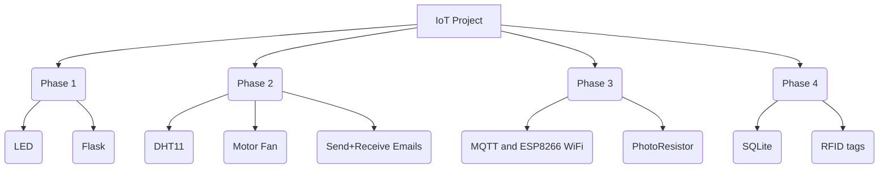

# IoT Project

## Table of Contents
1. [Phases](#phases)
2. [Tools used](#tools)
3. [Database Overview](#iothome-database)
4. [users Table](#users-table)
   - [Columns](#columns)
   - [Sample Data](#sample-data)
5. [Authors](#authors)

## Phases

## Tools
To work on this project, ensure you have the following set up:

- **Python**: Version 3.x installed for running Flask.
- **Flask**: Installed via `pip install flask`.
- **SQLite**: For local database storage.
- - **DHT11**: A sensor used to measure temperature and humidity.
- **Arduino IDE**: For programming Arduino microcontrollers and ESP8266.
- **ESP8266 WiFi Library**: To connect the ESP8266 modules to WiFi and send data such as Light Intensity Threshold to Raspberry Pi.
- **Raspberry Pi**: As the server environment.

## IoTHome Database
The SQLite database contains the following key table:

### users Table
The "users" table stores user-specific data for setting environmental thresholds in a smart home environment.

#### Columns
- **UserID** (Text): A unique identifier for each user in the system.
- **Name** (Text): The name of the user.
- **Temp. Threshold** (Integer): The temperature threshold set by the user in degrees Celsius. This value might trigger a specific action when reached.
- **Humidity Threshold** (Integer): The humidity threshold set by the user in percentage. This value might trigger a specific action when reached.
- **Light Intensity Threshold** (Integer): The light intensity threshold set by the user in lumens. This value might trigger a specific action when reached.

### Sample Data
To better understand the structure of the "Home" table, here's a sample set of data entries:

| UserID             | Name    | Temp. Threshold | Humidity Threshold | Light Intensity Threshold |
|--------------------|---------|-----------------|--------------------|---------------------------|
| 76 208 77 73       | Hibba   | 26              | 55                 | 450                       |
| 3 241 208 4        | Qaraman | 27              | 48                 | 470                       |
| 93 51 11 50        | Arsalan | 25              | 55                 | 500                       |
| 181 157 143 172    | Saeed   | 24              | 60                 | 490                       |
| 211 11 23 14       | Nabil   | 25              | 50                 | 500                       |
| 115 110 208 15     | Ramadan | 27              | 58                 | 600                       |

## Authors

- [Hibba Qaraman](https://github.com/hqara)
- [Muhammad Arsalan Saeed ](https://github.com/2191818)
- [Nabil Ramadan](https://github.com/Nabil-rn)
